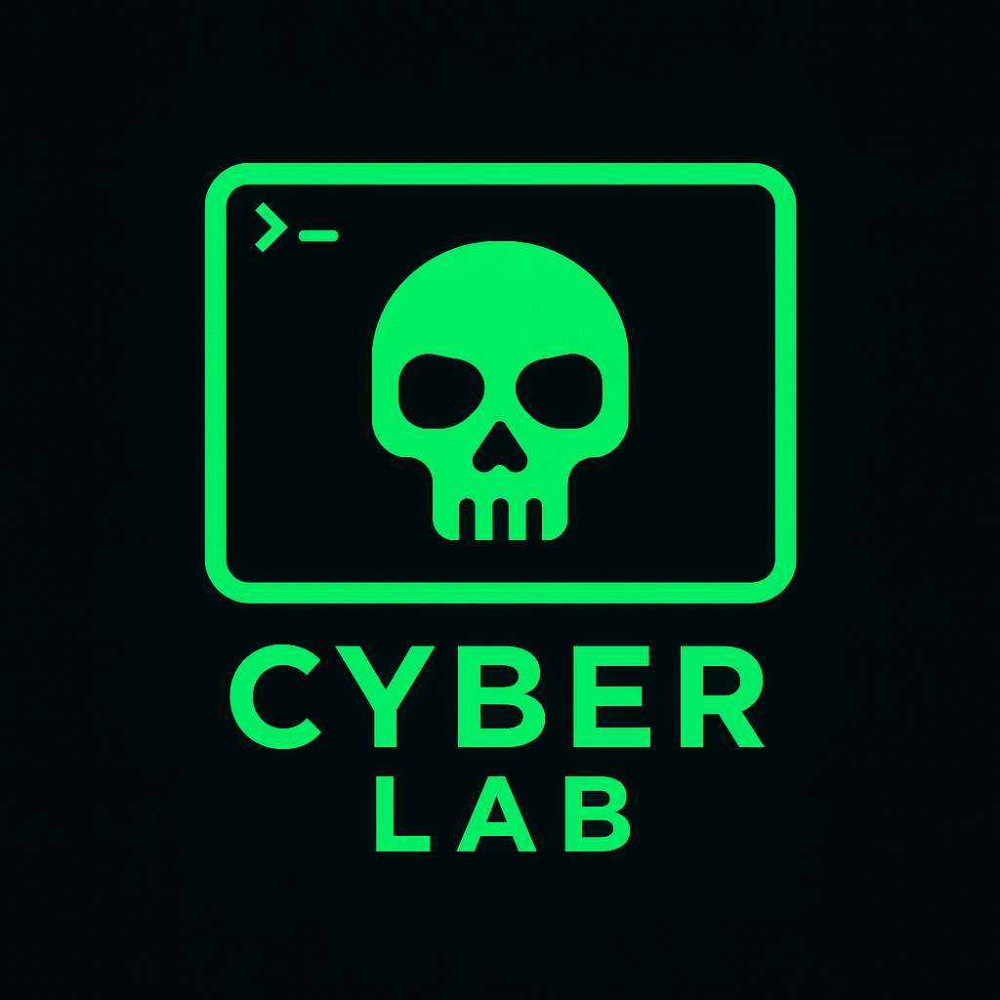

# 🐉 Purple Team Cyber Lab

This project builds a fully automated offensive, defensive and hybrid (purple team) cyber range using Kali Linux, Ansible, Podman and Vagrant. It’s optimized for local, high-fidelity security testing on Linux (VirtualBox or KVM) with support for Windows AD, vulnerable VMs and containerized web app targets.

## ⚙️ Features

- ⚔️ **Kali Linux** – Red team command center with Podmanized DVWA and Juice Shop
- 🎯 **Metasploitable 2 & 3** – Multiple vulnerable targets (Linux and Windows)
- 🧠 **Windows Server** – Active Directory with seeded BadBlood environment
- 🛠️ **Ansible Playbooks** – Automated provisioning of every system
- 🧱 **Podman Compose** – Deploys containerized web app targets (DVWA, Juice Shop)
- 📜 **Vagrant Integration** – Multi‑VM lab management via Vagrantfile
- 🧰 **Launcher & Teardown Scripts** – Full CLI automation experience

## 🚀 Quick Start

1. **Download and extract**
   ```bash
   unzip cyberLab.zip
   cd cyberLab
   ```
2. **Run setup**
   ```bash
   chmod +x scripts/setup.sh
   ./scripts/setup.sh
   ```
   This installs dependencies and builds Metasploitable 3 boxes automatically.
3. **Launch the lab**
   ```bash
   chmod +x scripts/launcher.sh
   ./scripts/launcher.sh
   ```
4. **(Optional) Update `/etc/hosts`**
   ```bash
   chmod +x scripts/update-hosts.sh
   ./scripts/update-hosts.sh
   ```
5. **(Optional) Run Logging Setup**
   ```bash
   chmod +x scripts/setup-logging.sh
   ./scripts/setup-logging.sh
   ```

## 🧠 Prerequisites

- Linux host with VirtualBox or KVM
- **Minimum specs**
  - 32 GB RAM (64 GB recommended)
  - 8‑core CPU
  - 100+ GB free disk space
- **Required packages:** `vagrant`, `virtualbox`, `ansible`, `packer`, `podman`, etc.

`setup.sh` installs all dependencies.

## 📁 Directory Structure

```text
cyberLab/
├── ansible/
│   ├── playbooks/             # All provisioning playbooks
│   └── roles/                 # Common Ansible roles
├── podman/
│   └── webapps/               # DVWA, Juice Shop + podman-compose.yml
├── scripts/
│   ├── setup.sh               # Dependency installer + MSF3 box builder
│   ├── launcher.sh            # Interactive launcher for lab components
│   ├── teardown.sh            # Stops and removes all VMs + boxes
│   └── update-hosts.sh        # Generates /etc/hosts entries for VMs
├── Vagrantfile                # Main lab VM definitions
└── README.md
```

## 🧩 VMs Deployed

| Name                    | Role                        | Provisioned With          |
|-------------------------|-----------------------------|---------------------------|
| kali                    | Red Team base               | Kali + Podman + Tools     |
| metasploitable2         | Vulnerable Linux target     | Legacy VM                 |
| metasploitable3-linux   | Advanced vuln Linux         | MSF3/Ansible              |
| metasploitable3-windows | Windows target              | MSF3 + WinRM              |
| winserver               | Domain Controller + AD      | Windows Server + BadBlood |

## 🔒 License

MIT License. Free to use, adapt, and extend.

## ✉️ Maintainer

Austin Dunn  
Principal Security Engineer  
📧 austin@austindunn.us

